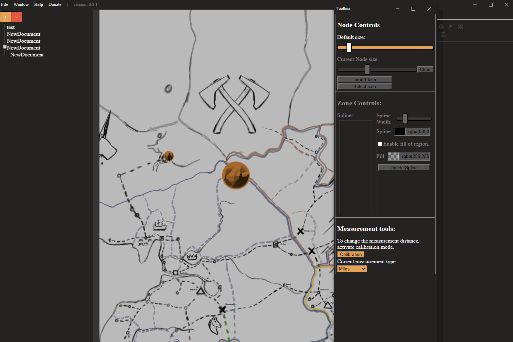

# DMmaps
A project designed to allow DM's to create large open worlds, and still keep track of them. Useing a visual database design to allow them to create document structures, and have nodes tied to documents which are placed on a map. Added to this is a suite of tools to help character creation, and keep track of locations, and regions on the map.

## Usage
Remember, regardless of the readme, you learn best by getting in and playing around, hopefully this readme will clear up some confusion.

### Installation
Download from the releases tab the latest setup file. After this the program will auto update when new releases are made.

### Getting Started
First import a background (usually the world map of your world, if you do not have one I highly suggest [Azgaar's Fantasy Map Generator](https://azgaar.github.io/Fantasy-Map-Generator/) for a free fully featured map generator.)

Once you have a background in remmember to save (**Ctrl+S**) to a location which you will remmember. It is recommended to push the database into a folder where you will keep your images.

**Map Controls**

Middle mouse button down will allow panning around.
Scroll wheel allows zooming in and out.
Right click at any time and select reset map to center map.

You can make nodes via right clicking the document, and selecting **Create Node** from the context menu.

**Nodes**

You can drag them around with left mouse button.
Lock/Unlock them via the context menu.

Once you have a node you will notice that a corrosponding document has been created. Any time a document is created it will appear on the hirearchy to the left. Two rules for this, documents will appear as children of the document you have selected, if you do not wish for this press **Ctrl+D** to deselect the document prior to creating a new one. Also when a new document is created the title will automatically be selected on the text editor, allowing quick renaming of the document.

**Documents**

You can drag a document to the bar on the left to unparent it.
Drag a document onto another document in the outliner to make it a child of that document.
You can also create a link from one document to another by draggin a document onto the text editor window on the right.

Once you have documents and nodes created you can also interact between the two, if you select a document and right click a node which either the document is not bound to or the document has no node at all, then you will get the option to **Bind Document to Node**, this will allow you to select the document via the node or vice versa.

Now that you have nodes and documents, if you open the toolbox you will have some options.

**ToolBox**

Within the tool box is two sections, node tools and zone tools. 
Node tools allow you to scale all nodes by a given amount, or an individually selected node by a seperate amount.
Clicking clear will allow you to reset a node to the default size of the rest of them.

Zone tools have options to create splines.
To draw a spline you must have the checkbox clicked and then left click on the map, continue to left click, or hold it down to freedraw. 
Right click to complete drawing on the spline.
You can select splines from the menu on the left of the toolbox to delete them, or change their settings.

After all of this you can also use the character creator, to easily and quickly come up with NPCs.

**Character Generator**

The drop down menu at the top will allow you to select a region you wish to have the name from.
Clicking rebuild on gender will rebuild name automatically, everything else is pretty straight forward.
Whenever anything is rebuilt the entire results are saved to the clipboard.

And that's it, you are good to go!

### Hotkeys

**Ctrl+S** - Saves current Database.

**Ctrl+Shift+S** - Saves Database to new location.

**F1/Ctrl+B** - Opens the Hirearchy Outliner.

**F2/Ctrl+E** - Opens the Document Editor.

**F3** - Opens the Toolbox.

**F5** - Opens the Character Generator.

**Ctrl+D** - Deselects current Document.

## License
[GNU](https://www.gnu.org/licenses/gpl-3.0.en.html)